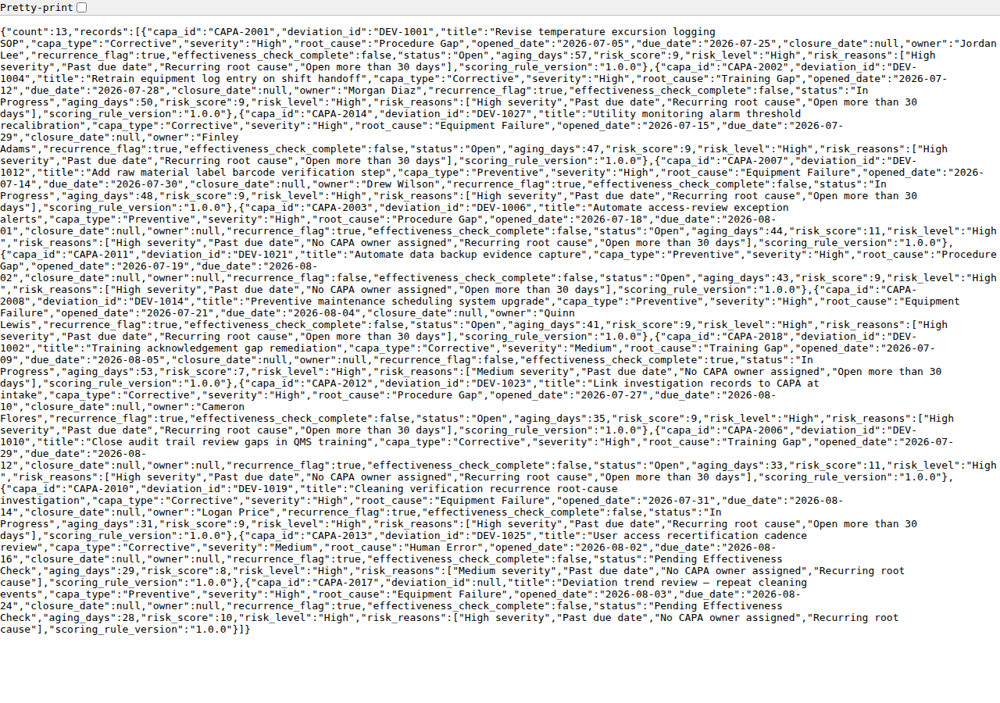
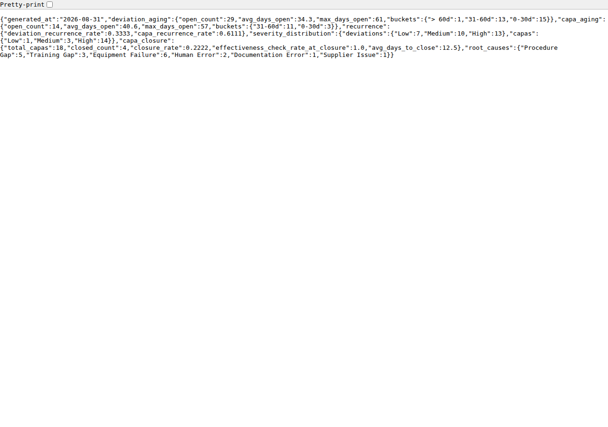
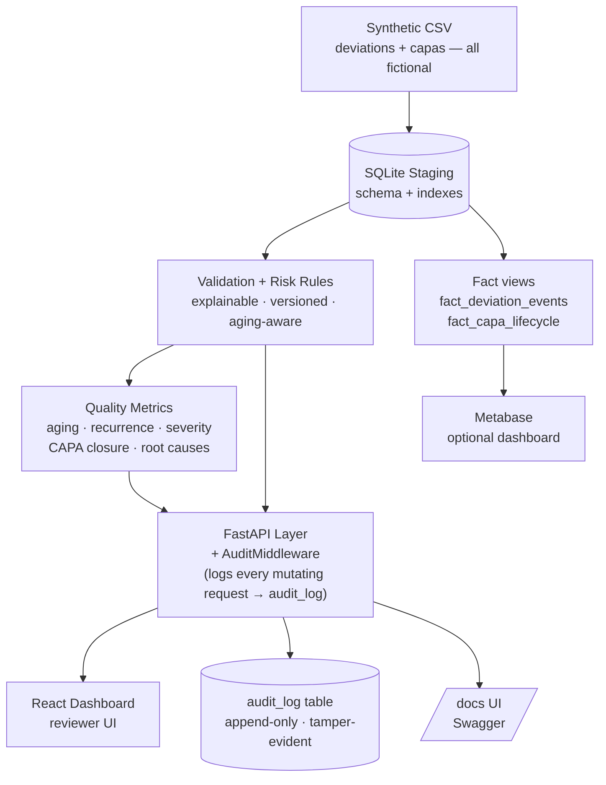
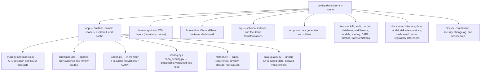

# Quality Deviation Risk Monitor

<div align="center">

[](https://github.com/alianisreyesr/quality-deviation-risk-monitor/actions/workflows/ci.yml)
[](https://github.com/alianisreyesr/quality-deviation-risk-monitor/actions/workflows/codeql.yml)


**GxP · CSV · 21 CFR Part 11 · ALCOA+ · Data Integrity · Audit Trail · CAPA**

*A portfolio-safe, full-stack prototype for pharmaceutical Quality Data Engineering*

[Screenshots](#portfolio-preview) · [Quick Start](#quick-start) · [Case study](docs/CASE_STUDY.md) · [Architecture](docs/architecture.md) · [Data Model](docs/data-dictionary.md) · [Risk Rules](docs/risk-rules.md) · [Metrics & Dashboard](docs/dashboard.md) · [Demo Walkthrough](docs/demo-walkthrough.md) · [Security](SECURITY.md)

</div>

---

> **⚠️ Data Boundary:** Every record, name, and scenario is entirely fictional. This repository contains no proprietary information, employer data, processes, or code. It is not validated software and must not be used for regulated quality decisions.

---

## Portfolio preview

| Reviewer queue | Explainable review panel |
|---|---|
|  |  |

| High-risk CAPA (explainable, with aging) | Quality metrics |
|---|---|
|  |  |

See the [case study](docs/CASE_STUDY.md) for the business problem, users, decisions, evidence, and production boundary.

## What This Is

A **full-stack quality deviation and CAPA prioritization system** that models how a data engineer approaches regulated backlog management: with traceable data pipelines, explainable rule-based scoring, aging-aware CAPA lifecycle tracking, and a tamper-evident audit trail aligned to 21 CFR Part 11 and ALCOA+.

In GxP manufacturing, unreviewed deviations and stalled corrective/preventive actions (CAPA) accumulate regulatory risk. This prototype answers: *how do you surface the right record, at the right time, with full traceability — and prove your quality metrics are computed the same way every time?* — using transparent engineering instead of black-box ML.

**Built with:** Python · FastAPI · Pydantic v2 · SQLite · React · Vite · Docker · GitHub Actions CI · Metabase (optional dashboard)

---

## Skills Demonstrated

> Mapped to job descriptions for **Quality Data Engineer**, **CSV Analyst**, and **IT Compliance** roles.

| Domain | What This Project Shows |
|---|---|
| **Data Pipeline & SQL** | Synthetic CSV → SQLite staging with schema constraints, indexes, and validated ingestion for **deviations and CAPA** |
| **SQL Transformations** | `sql/transformations.sql` — analytics-ready `fact_deviation_events` / `fact_capa_lifecycle` views (overdue flags, aging, severity weights) applied on every startup |
| **21 CFR Part 11 / Audit Trail** | Append-only `audit_log` table; `AuditMiddleware` logs every mutating HTTP request; UTC server-generated timestamps — never client-supplied |
| **ALCOA+ Data Integrity** | Attributable (actor header), Legible, Contemporaneous, Original, Accurate — modeled in schema and API layer |
| **Explainable Risk Scoring** | Independently versioned, rule-based scorers for deviations **and CAPA**; every response returns `risk_reasons[]` so reviewers can evaluate — not blindly accept — the output |
| **Data Quality Engineering** | Unique-ID, required-field, valid-date, and allowed-value checks for both datasets (`GET /data-quality`, `GET /capas/data-quality`) |
| **Quality Metrics** | `GET /metrics` — aging, recurrence, severity distribution, CAPA closure rate, and root-cause breakdown, computed live |
| **API Engineering** | FastAPI + Pydantic v2 with rate limiting (SlowAPI), structured error handling, and OpenAPI docs auto-generated |
| **Testing & CI** | 174 tests across 15 modules (unit + integration); GitHub Actions runs the full suite on every push |
| **Containerization** | Dockerfile + docker-compose for reproducible, environment-agnostic deployment; optional Metabase dashboard profile |
| **Documentation** | Architecture, data model, risk rules, metrics, **regulatory references (FDA / MHRA / PIC/S / EU)**, controls, known limitations, and CHANGELOG |

---

## Architecture



See [architecture and data lineage →](docs/architecture.md) · [data model →](docs/data-dictionary.md) · [regulatory references →](docs/REGULATORY_REFERENCES.md)

---

## Quick Start

### Option A — Local (Python + Node)

```bash
# 1. Clone
git clone https://github.com/alianisreyesr/quality-deviation-risk-monitor.git
cd quality-deviation-risk-monitor

# 2. Backend
python -m venv .venv
source .venv/bin/activate          # Windows: .venv\Scripts\activate
pip install -r requirements.txt
uvicorn app.main:app --reload
# → API at http://127.0.0.1:8000
# → Swagger UI (interactive API docs) at http://127.0.0.1:8000/docs
# → ReDoc at http://127.0.0.1:8000/redoc

# 3. Frontend (new terminal)
cd frontend
npm install && npm run dev
# → Reviewer dashboard at http://127.0.0.1:5173
```

Then work through the [local demo walkthrough](docs/demo-walkthrough.md) for a
scripted tour of every endpoint (health, deviations, CAPA, data quality,
metrics, review + audit trail).

### Option B — Docker (one command)

```bash
docker compose up --build
```

Add the optional BI dashboard (Metabase over the same SQLite database — see
[docs/dashboard.md](docs/dashboard.md) for one-time setup):

```bash
docker compose --profile dashboard up --build
```

---

## API Reference

| Endpoint | Method | Purpose |
|---|---|---|
| `/health` | GET | Service state + version + synthetic-data boundary confirmation |
| `/deviations` | GET | Scored deviations; filterable by `risk_level` and `review_status` |
| `/deviations/{id}` | GET | Single record with explainable `risk_reasons[]` |
| `/deviations/{id}/review` | POST | Record review action (`acknowledge` / `investigate` / `close`) — appends to audit log |
| `/summary` | GET | Queue counts, overdue items, unassigned records |
| `/capas` | GET | Scored CAPA records with `aging_days`; filterable by `risk_level` and `status` |
| `/capas/{id}` | GET | Single CAPA record with explainable `risk_reasons[]` |
| `/data-quality` | GET | Deviation dataset quality report (unique IDs, required fields, valid dates, allowed values) |
| `/capas/data-quality` | GET | CAPA dataset quality report — same checks as above |
| `/metrics` | GET | Aggregated aging, recurrence, severity, CAPA closure, and root-cause metrics |
| `/audit-log` | GET | Full immutable audit log, newest-first; filterable by `deviation_id` |
| `/cache/invalidate` | POST | Manual cache invalidation |

> Full interactive docs auto-generated at `/docs` (Swagger UI) and `/redoc` — run the project locally to explore.

---

## Risk Scoring Model

The score is **explainable, not predictive** — designed to assist reviewers, not replace their judgment. This mirrors the expectation in regulated environments where algorithmic decisions must be defensible.

| Signal | Points | Rationale |
|---|---|---|
| Severity = Critical | +3 | Highest regulatory exposure |
| Severity = Major | +2 | Significant process deviation |
| Past due | +2 | Overdue review creates backlog risk |
| Missing owner | +1 | Unassigned deviations stall investigation |
| Recurrence flag | +1 | Repeat issues indicate systemic failure |
| Incomplete record | +1 | Missing fields impede audit readiness |

**Thresholds:** `High` ≥ 5 · `Medium` 2–4 · `Low` 0–1

Every API response includes `risk_reasons[]` — a list of human-readable strings explaining the score. Reviewers evaluate, not blindly accept, the prioritization.

### CAPA Risk & Aging

CAPA (Corrective and Preventive Action) records use an independently versioned rule set (`app/capa_scoring.py`) so it can evolve without touching deviation scoring:

| Signal | Points | Rationale |
|---|---:|---|
| High / Medium severity | 3 / 1 | Same regulatory-exposure logic as deviations |
| Past due (still open) | 3 | Timeliness concern |
| No CAPA owner (still open) | 2 | Accountability gap |
| Recurring root cause | 2 | Systemic, not isolated, failure |
| Missing root cause | 1 | Incomplete investigation record |
| Closed without a completed effectiveness check | 2 | Unverified closure is a data-integrity gap |
| Open more than 60 / 30 days | 2 / 1 | Aging — a stalled corrective action |

Every CAPA response also returns `aging_days`: while open it is `today − opened_date`; once closed it **freezes** at `closure_date − opened_date` (time to close), so historical aging stays meaningful instead of growing forever.

See [risk rules and controls →](docs/risk-rules.md)

---

## Data Model

| Table | Purpose | Key fields |
|---|---|---|
| `deviations` | Quality events requiring review | `deviation_id`, `severity`, `due_date`, `review_status`, `repeat_occurrence` |
| `capas` | Corrective/preventive actions, optionally linked to a deviation | `capa_id`, `deviation_id`, `capa_type`, `root_cause`, `status`, `effectiveness_check_complete` |

`sql/transformations.sql` layers two analytics-ready SQL views on top, applied automatically on every startup:

- **`fact_deviation_events`** — one row per deviation with `severity_weight`, `is_overdue`, `is_unassigned`, `days_open`
- **`fact_capa_lifecycle`** — one row per CAPA with `is_overdue`, `days_open` (freezes at closure), `root_cause_bucket`, `closed_without_effectiveness_check`

These views back both `GET /metrics` and the [optional Metabase dashboard](docs/dashboard.md) — see full field definitions in the [data dictionary →](docs/data-dictionary.md)

---

## Quality Metrics

`GET /metrics` computes, live from the current dataset:

| Metric | What it answers |
|---|---|
| `deviation_aging` / `capa_aging` | How long open records have sat, bucketed at 30/60-day tiers |
| `recurrence` | Share of deviations/CAPAs flagged as a repeat occurrence / recurring root cause |
| `severity_distribution` | Low/Medium/High counts for both record types |
| `capa_closure` | Closure rate, effectiveness-check rate at closure, average time-to-close |
| `root_causes` | CAPA count per root-cause category |

Same figures back the [Metabase starter dashboard →](docs/dashboard.md).

---

## Audit Trail Design (21 CFR Part 11 / ALCOA+)

Every `POST /deviations/{id}/review` appends one immutable row. `AuditMiddleware` also logs all mutating HTTP requests. The `audit_log` table is **never updated or deleted** — only inserted into.

| Field | Description |
|---|---|
| `actor` | Required reviewer identifier (`X-Actor` header) — Attributable |
| `action` | `acknowledge` / `investigate` / `close` / `METHOD /path` |
| `previous_status` / `new_status` | Before-and-after workflow state |
| `comment` | Optional rationale or request-body snapshot (max 1,000 chars) |
| `ip_address` / `user_agent` | Client traceability |
| `status_code` / `latency_ms` | HTTP metadata for middleware-logged events |
| `created_at` | UTC timestamp, server-generated — never client-supplied — Contemporaneous |

---

## Repository Structure



---

## Test Suite

174 tests · 15 modules · runs on every push via GitHub Actions CI

```bash
pytest -q
```

See [`.github/workflows/ci.yml`](.github/workflows/ci.yml) for the CI configuration.

---

## Scope & Production Path

This is a **learning and portfolio artifact** built to demonstrate GxP-relevant engineering patterns. Production use in a regulated environment would additionally require:

- Formal IQ/OQ/PQ validation with test protocols and sign-off
- Requirements Traceability Matrix (RTM)
- Role-based access control and user authentication
- Change control documentation and version locking
- Security assessment and penetration testing
- Governed SOPs and procedural controls

See [IMPROVEMENTS.md](IMPROVEMENTS.md) and [docs/REGULATORY_REFERENCES.md](docs/REGULATORY_REFERENCES.md).

---

## Regulated Portfolio Ecosystem

| Project | Domain Focus | Status |
|---|---|---|
| **[CSV Evidence Tracker](https://github.com/alianisreyesr/csv-evidence-tracker)** | Requirements traceability, IQ/OQ/PQ test execution, audit trail | ✅ Active · 44 tests |
| **[GxP Change Control](https://github.com/alianisreyesr/gxp-change-control)** | Controlled change lifecycle & approvals | ✅ Active · 68 tests |
| **[Data Integrity Case File](https://github.com/alianisreyesr/data-integrity-case-file)** | ALCOA+ investigation, CAPA readiness, local AI triage | ✅ Active |
| **[CSA Assurance Planner](https://github.com/alianisreyesr/csa-assurance-planner)** | Risk-based software assurance planning, FDA CSA alignment | ✅ Active |
| **[GxP Batch Data Pipeline](https://github.com/alianisreyesr/gxp-batch-data-pipeline)** | Batch manufacturing pipeline — DuckDB · dbt · quality gates | ✅ Active · 12 tests |

---

<div align="center">

**Built by [Alianis Reyes-Reyes](https://www.linkedin.com/in/alianis-reyes-reyes/)**

Information Systems @ UPRM · Eli Lilly Tech@Lilly Alumni

*Every iteration of this project is a question: what would make this more trustworthy, more traceable, more useful in a real regulated environment? That question doesn't have a final answer — and that's exactly what keeps it interesting.*

</div>
