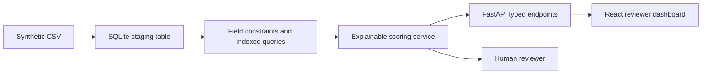

# Architecture and Data Lineage

## System flow

## Design decisions

| Layer | Implementation | Control value |
| --- | --- | --- |
| Source | Version-controlled synthetic CSV | No employer data or proprietary records |
| Persistence | SQLite with constraints and indexes | Structured fields and repeatable local setup |
| Logic | Rule-based Python service | Traceable scoring and reasons |
| Interface | FastAPI plus React dashboard | Clear review queue and decision context |
| Assurance | Pytest and GitHub Actions | Repeatable automated verification |

## Data lifecycle

On first application startup, the service creates the SQLite schema and seeds it from the synthetic CSV only when the table is empty. API requests query SQLite, apply the documented risk rules, and return typed responses. The dashboard consumes those responses through Vite's local development proxy.

## Non-production boundary

This is a portfolio demonstration, not validated software. It has no identity management, electronic-record controls, immutable audit trail, approval workflow, or production validation package.
