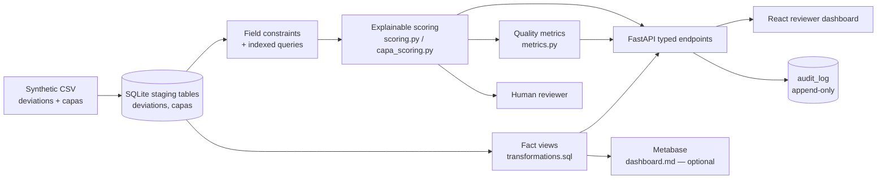

# Architecture and Data Lineage

## System flow

## Design decisions

| Layer | Implementation | Control value |
| --- | --- | --- |
| Source | Version-controlled synthetic CSV (`data/deviations.csv`, `data/capas.csv`) | No employer data or proprietary records |
| Persistence | SQLite with constraints and indexes | Structured fields and repeatable local setup |
| Analytics layer | SQL views (`sql/transformations.sql`): `fact_deviation_events`, `fact_capa_lifecycle` | Dashboard-ready facts without duplicating scoring logic in SQL |
| Logic | Rule-based Python services (`app/scoring.py`, `app/capa_scoring.py`) | Traceable, versioned scoring and reasons for both record types |
| Metrics | `app/metrics.py` → `GET /metrics` | Aging, recurrence, severity, CAPA closure, and root-cause figures computed once and reused by the API and the dashboard |
| Interface | FastAPI plus React dashboard | Clear review queue and decision context |
| Audit trail | `AuditMiddleware` + append-only `audit_log` table | Attributable, timestamped record of every mutating request (21 CFR Part 11 / ALCOA+ posture) |
| Assurance | Pytest and GitHub Actions | Repeatable automated verification |

## Data lifecycle

On first application startup, the service creates the SQLite schema, applies `sql/transformations.sql` (idempotent views), and seeds `deviations` and `capas` from their synthetic CSVs only when each table is empty. API requests query SQLite, apply the documented risk rules (`docs/risk-rules.md`), and return typed responses. `GET /metrics` recomputes aging, recurrence, severity, closure, and root-cause figures live from the same tables. The dashboard consumes API responses through Vite's local development proxy; an optional Metabase instance (`docs/dashboard.md`) queries the fact views directly for ad-hoc exploration.

## CAPA as an additive layer

CAPA records are modeled independently from deviations (`capas` table, optionally linked via `deviation_id`) rather than as a status on the deviation itself. This keeps deviation intake and corrective/preventive action tracking — two different regulatory workflows in a real QMS — separately auditable, while still allowing cross-record reporting (`GET /metrics`, `fact_capa_lifecycle`).

## Non-production boundary

This is a portfolio demonstration, not validated software. It has no identity management, formal role-based access control, or production validation package (IQ/OQ/PQ). The audit trail, risk scoring, and data-quality checks demonstrate the *pattern* a validated system would need — they are not a substitute for one. See [IMPROVEMENTS.md](../IMPROVEMENTS.md) and [docs/REGULATORY_REFERENCES.md](REGULATORY_REFERENCES.md).
